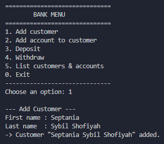
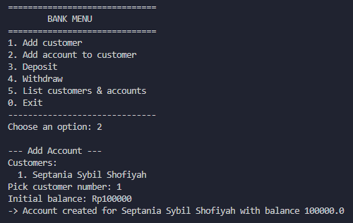
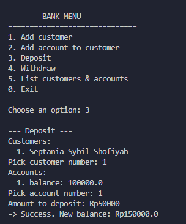
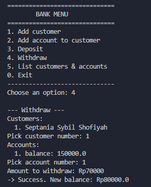
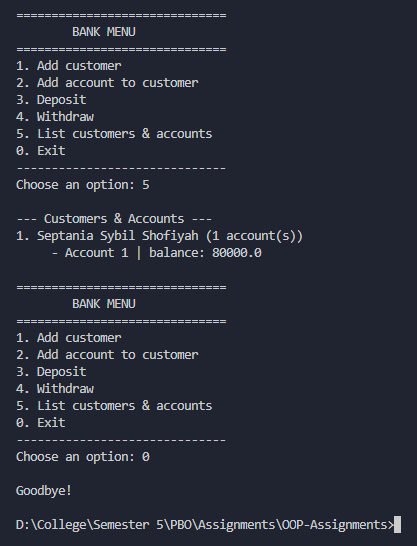

# Bank Management System

A simple Java console program that models a bank with customers and
accounts, using arrays and object-oriented programming (classes,
encapsulation, constructors). The program is menu-driven and reads
input with `java.util.Scanner`.

## Files

| File | Purpose |
|---|---|
| `Account.java` | One bank account: holds a balance, can deposit/withdraw. |
| `Customer.java` | One customer: holds a name and a list of their accounts. |
| `Bank.java` | The bank: holds a list of customers. |
| `BankMenu.java` | The program entry point: shows a menu, reads input, calls the classes above. |

## How to compile and run

```bash
javac Account.java Customer.java Bank.java BankMenu.java
java BankMenu
```

## Class by class

### `Account.java`

Represents a single bank account.

```java
public class Account {
    private double balance;

    public Account(double init_balance) {
        balance = init_balance;
    }

    public double getBalance() {
        return balance;
    }

    public boolean deposit(double amt) {
        if (amt > 0) {
            balance = balance + amt;
            return true;
        } else {
            return false;
        }
    }

    public boolean withdraw(double amt) {
        if (balance >= amt) {
            balance = balance - amt;
            return true;
        } else {
            return false;
        }
    }
}
```

- **`balance`** is `private`. Nothing outside this class can change it
  directly, it can only go through `deposit()` or `withdraw()`. This is
  encapsulation: it stops a balance from being set to an invalid value
  by mistake.
- **Constructor `Account(init_balance)`** sets the starting balance
  when the account is created.
- **`getBalance()`** is a plain accessor (getter), it just returns the
  current balance.
- **`deposit(amt)`** only adds the amount if it's positive, and returns
  `true`/`false` to say whether it worked. Because `balance =
  balance + amt`, every deposit builds on top of whatever the balance
  already was, it never resets to `init_balance`.
- **`withdraw(amt)`** only subtracts if there's enough balance to cover
  it, again returning `true`/`false`.

### `Customer.java`

Represents a bank customer, who can own multiple accounts.

```java
public class Customer {
    private String firstName;
    private String lastName;
    private Account[] accounts = new Account[5];
    private int numberOfAccounts = 0;

    public Customer(String f, String l) {
        firstName = f;
        lastName = l;
    }

    public String getFirstName() { return firstName; }
    public String getLastName() { return lastName; }

    public void setAccount(Account acct) {
        if (numberOfAccounts < 5) {
            accounts[numberOfAccounts++] = acct;
        }
    }

    public Account getAccount(int account_index) {
        return accounts[account_index];
    }

    public int getNumOfAccounts() {
        return numberOfAccounts;
    }
}
```

- **`accounts`** is a fixed-size array (`Account[5]`), since arrays in
  Java can't grow, and this customer can hold at most 5 accounts.
- **`numberOfAccounts`** tracks how many accounts are actually filled
  in, since the array's own `.length` is always 5 even when it's
  empty.
- **Constructor `Customer(f, l)`** sets the first and last name.
- **`setAccount(acct)`** adds a new account to the next free slot, then
  increments `numberOfAccounts`. It checks `numberOfAccounts < 5`
  first so it never writes past the end of the array.
- **`getAccount(index)`** returns the account at that array position.
- **`getNumOfAccounts()`** returns how many accounts this customer
  currently has.

### `Bank.java`

Represents the whole bank, which holds a list of customers, following
the same array + counter pattern as `Customer`.

```java
public class Bank {
    private Customer[] customers;
    private int numberOfCustomers;

    public Bank() {
        customers = new Customer[10];
        numberOfCustomers = 0;
    }

    public void addCustomer(String f, String l) {
        if (numberOfCustomers < customers.length) {
            customers[numberOfCustomers] = new Customer(f, l);
            numberOfCustomers++;
        }
    }

    public int getNumOfCustomers() { return numberOfCustomers; }

    public Customer getCustomer(int index) { return customers[index]; }
}
```

- **`customers`** is a fixed-size array that can hold up to 10
  customers.
- **`numberOfCustomers`** tracks how many customers have actually been
  added so far.
- **Constructor `Bank()`** creates the array and starts the counter at
  0.
- **`addCustomer(f, l)`** builds a brand new `Customer` object from the
  first/last name, places it in the next free slot, and increments the
  counter. Like `setAccount`, it checks the array isn't full first.
- **`getNumOfCustomers()`** and **`getCustomer(index)`** are simple
  accessors used by `BankMenu` to loop through and display customers.

### `BankMenu.java`

The entry point of the program (has `main`). It's a text menu loop
that reads the user's choices with `Scanner` and calls methods on
`Bank`, `Customer`, and `Account` to do the actual work.

**Overall structure:**

```java
public static void main(String[] args) {
    int choice;
    do {
        printMenu();
        choice = readInt("Choose an option: ");
        switch (choice) {
            case 1 -> addCustomer();
            case 2 -> addAccount();
            case 3 -> deposit();
            case 4 -> withdraw();
            case 5 -> listCustomers();
            case 0 -> System.out.println("\nGoodbye!");
            default -> System.out.println("\nInvalid option, try again.");
        }
    } while (choice != 0);
    scanner.close();
}
```

The `do...while` loop keeps showing the menu and reacting to the
choice until the person types `0`, which exits the loop and closes the
`Scanner`.

**Menu options, one at a time:**

- **`printMenu()`** — just prints the menu text (options 0-5).

- **`addCustomer()`** — asks for a first and last name with
  `scanner.nextLine()`, then calls `bank.addCustomer(first, last)`.

- **`addAccount()`** — calls `pickCustomer()` to let the person choose
  which customer, asks for an initial balance with `readDouble()`,
  then calls `c.setAccount(new Account(initial))` to attach a new
  account to that customer.

- **`deposit()`** — picks a customer, then an account (via
  `pickCustomer()` and `pickAccount()`), asks how much to deposit, and
  calls `a.deposit(amount)`. Prints success with the new balance, or a
  failure message if the amount wasn't positive.

- **`withdraw()`** — same pattern as `deposit()`, but calls
  `a.withdraw(amount)` and fails if the balance is too low.

- **`listCustomers()`** — loops through every customer in the bank and
  every account each customer has, printing them all in a readable,
  numbered list.

**Helper methods:**

- **`pickCustomer()`** — prints the list of customers, asks the person
  to pick one by number, and returns that `Customer` object (or `null`
  if the number was invalid or there are no customers yet).
- **`pickAccount(c)`** — same idea, but for one customer's accounts.
- **`readInt(prompt)`** / **`readDouble(prompt)`** — wrap
  `scanner.nextInt()` / `scanner.nextDouble()` with a loop that keeps
  asking again if the person types something that isn't a valid
  number, so the program never crashes on bad input.

**Display numbering (1-based):** Internally, all arrays still use
Java's normal 0-based indexing (`customers[0]`, `accounts[0]`, ...).
But `pickCustomer()`, `pickAccount()`, and `listCustomers()` all print
`(i + 1)` instead of `i`, so the person sees a friendlier "1, 2, 3..."
list. When they type a number back, it's converted with `index =
choice - 1` before touching the array, so a person typing `1` for the
first customer still correctly reaches `customers[0]`.

## Screenshots

**Add Customer

**Add Account

**Deposit

**Withdraw

**List Customer and Exit


## Design notes

- **Why arrays instead of `ArrayList`?** This mirrors the exercise the
  program is based on (`Bank`/`Customer` with a fixed-size array and a
  counter attribute), which is a common early step before switching to
  `ArrayList<T>`.
- **Why `private` fields everywhere?** Encapsulation: every field
  (`balance`, `firstName`, `accounts`, `customers`, etc.) can only be
  read or changed through public methods, never touched directly from
  outside the class.
- **Why does `deposit`/`withdraw` return `boolean`?** So the caller
  (`BankMenu`) can tell whether the operation actually succeeded, and
  print an appropriate success/failure message, instead of the method
  failing silently.