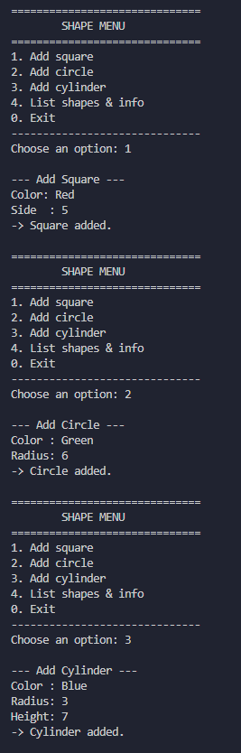
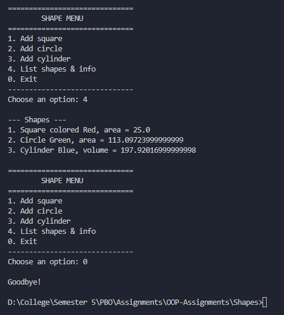

# Shape Management System

A Java console program that models geometric shapes (`Shape`,
`Square`, `Circle`, `Cylinder`) using inheritance, and lets the user
add shapes interactively through a menu, using `java.util.Scanner`.

## Files

| File | Purpose |
|---|---|
| `Shape.java` | The parent class: every shape has a color. |
| `Square.java` | A shape with a side, calculates area. |
| `Circle.java` | A shape with a radius, calculates area. |
| `Cylinder.java` | A circle with a height, calculates volume. |
| `ShapeMenu.java` | The program entry point: shows a menu, reads input, creates shapes. |

## How to compile and run

```bash
javac Shape.java Square.java Circle.java Cylinder.java ShapeMenu.java
java ShapeMenu
```

## Class hierarchy

```
            Shape
      # color : String
              |
   -----------------------
   |                      |
 Square                 Circle
 - side : double        # radius : double
                        + PI : static final
                              |
                          Cylinder
                          - height : double
```

`Square` and `Circle` both extend `Shape`. `Cylinder` extends `Circle`
(a cylinder is treated as a circle with an added height), so it
inherits `radius` and `color` from `Circle` and `Shape`.

## Class by class

### `Shape.java`

The parent class of every shape.

```java
public class Shape {
    protected String color;

    public Shape(String color) {
        this.color = color;
    }

    public String getColor() { return color; }
    public void setColor(String color) { this.color = color; }

    public void printInfo() {
        System.out.println("Shape colored " + color);
    }
}
```

- **`color`** is `protected`, not `private`. This is on purpose: it
  needs to be readable directly by subclasses (`Square`, `Circle`,
  `Cylinder`) inside their own `printInfo()` methods, while still being
  hidden from code outside the class hierarchy.
- **Constructor `Shape(color)`** sets the color when the shape is
  created. Every subclass constructor calls this first via `super(color)`.
- **`getColor()` / `setColor()`** are the standard accessor/mutator
  pair for `color`.
- **`printInfo()`** prints a description of the shape. Each subclass
  **overrides** this method to print its own kind of description
  (this is polymorphism: the same method name, different behavior
  depending on the actual object).

### `Square.java`

```java
public class Square extends Shape {
    private double side;

    public Square(double side, String color) {
        super(color);
        this.side = side;
    }

    public double getSide() { return side; }
    public void setSide(double side) { this.side = side; }

    public double area() { return side * side; }

    @Override
    public void printInfo() {
        System.out.println("Square colored " + color + ", area = " + area());
    }
}
```

- **`side`** is `private`, only this class can touch it directly.
- **Constructor `Square(side, color)`** calls `super(color)` first (to
  set up the inherited `color` field), then sets `side`.
- **`area()`** computes `side * side`.
- **`printInfo()`** overrides the parent version to print the color
  and the area.

### `Circle.java`

```java
public class Circle extends Shape {
    public static final double PI = 3.14159;
    protected double radius;

    public Circle(double radius, String color) {
        super(color);
        this.radius = radius;
    }

    public double getRadius() { return radius; }
    public void setRadius(double radius) { this.radius = radius; }

    public double area() { return PI * radius * radius; }

    @Override
    public void printInfo() {
        System.out.println("Circle " + color + ", area = " + area());
    }
}
```

- **`PI`** is `public static final`, a class constant. `static` means
  it belongs to the `Circle` class itself (not to each individual
  object), and `final` means it can never be reassigned.
- **`radius`** is `protected` (not `private`), for the same reason
  `color` is protected in `Shape`: `Cylinder` needs to read it
  directly since it extends `Circle`.
- **Constructor, getter/setter, `area()`, `printInfo()`** follow the
  same pattern as `Square`.

### `Cylinder.java`

```java
public class Cylinder extends Circle {
    private double height;

    public Cylinder(double height, double radius, String color) {
        super(radius, color);
        this.height = height;
    }

    public double getHeight() { return height; }
    public void setHeight(double height) { this.height = height; }

    public double volume() { return area() * height; }

    @Override
    public void printInfo() {
        System.out.println("Cylinder " + color + ", volume = " + volume());
    }
}
```

- **`height`** is `private`, unique to `Cylinder`.
- **Constructor `Cylinder(height, radius, color)`** calls
  `super(radius, color)` first, which runs `Circle`'s constructor
  (which itself calls `Shape`'s constructor). Only after that does it
  set `height`.
- **`volume()`** reuses the inherited `area()` method from `Circle`
  (a cylinder's volume is base area × height), so there's no need to
  redo the area formula here.
- **`printInfo()`** overrides again, this time printing the volume
  instead of area.

### `ShapeMenu.java`

The entry point of the program (has `main`). A menu loop that reads
choices with `Scanner` and creates `Shape` objects based on user
input.

**Overall structure:**

```java
public static void main(String[] args) {
    int choice;
    do {
        printMenu();
        choice = readInt("Choose an option: ");
        switch (choice) {
            case 1 -> addSquare();
            case 2 -> addCircle();
            case 3 -> addCylinder();
            case 4 -> listShapes();
            case 0 -> System.out.println("\nGoodbye!");
            default -> System.out.println("\nInvalid option, try again.");
        }
    } while (choice != 0);
    scanner.close();
}
```

Same `do...while` pattern as the bank program: keep showing the menu
until the person types `0`.

**Storage:**

```java
private static Shape[] shapes = new Shape[20];
private static int numberOfShapes = 0;
```

All shapes, squares, circles, and cylinders alike, are stored in one
`Shape[]` array. This works because of polymorphism: a `Square`,
`Circle`, or `Cylinder` **is a** `Shape`, so each one can be stored in
a `Shape`-typed slot. `numberOfShapes` tracks how many slots are
filled, the same array + counter pattern used in the bank program.

**Menu options:**

- **`addSquare()` / `addCircle()` / `addCylinder()`** — each asks for
  the relevant values (color, side, radius, height as needed) with
  `readString()` / `readDouble()`, builds the object, and stores it in
  `shapes[numberOfShapes++]`. `isFull()` is checked first so the array
  never overflows.
- **`listShapes()`** — loops through every stored shape and calls
  `shapes[i].printInfo()`. Because each shape overrides `printInfo()`
  differently, the same loop line prints a different message depending
  on whether the object is actually a `Square`, `Circle`, or
  `Cylinder`, without any `if`/`else` checking the type. This is the
  polymorphism concept from the slides: "one call, many behaviours."

**Helper methods:**

- **`isFull()`** — checks whether the array has run out of space.
- **`readString(prompt)`** — reads a line of text.
- **`readInt(prompt)` / `readDouble(prompt)`** — same validated-input
  pattern as the bank program: keep asking again if the input isn't a
  valid number, so the program never crashes on bad input.

**Display numbering (1-based):** Like the bank program, the array is
0-based internally (`shapes[0]`, `shapes[1]`, ...), but `listShapes()`
prints `(i + 1)` so the list looks like "1, 2, 3..." to the user.

## Screenshot

Add Shape <br>
 <br>
List Shape and Exit <br>
 <br>

## Design notes

- **Why is `color` `protected` instead of `private`?** So subclasses
  can read it directly inside their own overridden `printInfo()`
  methods, without needing an extra getter call. `radius` in `Circle`
  is protected for the same reason, `Cylinder` needs it.
- **Why does `Cylinder` extend `Circle` instead of `Shape`?** A
  cylinder's cross-section is a circle, so it reuses `radius`, `PI`,
  and `area()` from `Circle` instead of repeating that logic.
- **Why store everything in one `Shape[]` array?** This demonstrates
  polymorphism directly: the array doesn't need to know or care which
  exact subclass each element is, calling `printInfo()` on any element
  always runs the correct version for that object.